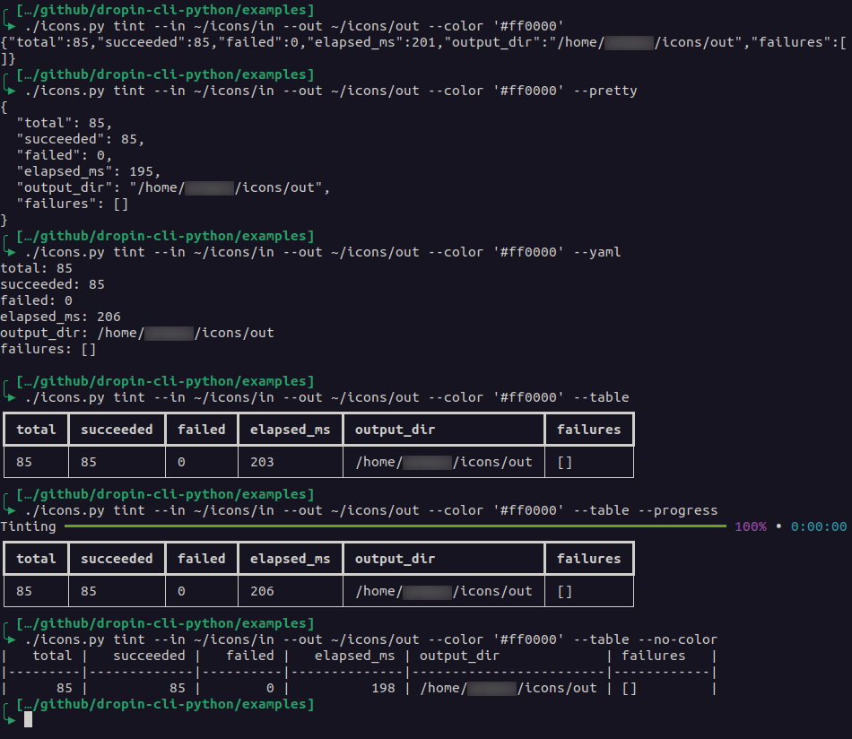

# dropin-cli-python

Minimal, dependency‑light helper to build single‑file CLIs in Python:
- Collects command functions automatically with a decorator.
- Prints results as JSON, YAML, or ASCII/pretty tables.
- Optional progress bars and a simple thread‑pool runner.
- Batteries for a pragmatic DVDT (Discover → Validate → Do → Tell) workflow.

Works great for quick internal utilities with a polished command-line UX.

> **Python:** 3.9+ (uses modern type hints)  
> **Dependencies:** none required. Optional: `rich`, `tabulate`, `PyYAML`, `tqdm`.  
> **Examples:** `Pillow` is needed only for `icons.py`.

---

## Quick start

1) Copy `src/cli.py` next to your script (or add `src/` to `PYTHONPATH`).
2) Define commands with `@command` and return data; `dispatch()` handles parsing and output.

````python
# mytool.py
from cli import command, dispatch

@command(add_args=lambda p: p.add_argument("words", nargs="*"))
def cmd_echo(args):
    """Echo words"""
    return [{"idx": i, "word": w} for i, w in enumerate(args.words)]

if __name__ == "__main__":
    raise SystemExit(dispatch())
`````

## The DVDT (Discover, Validate, Do, Tell) Pattern

DVDT is a lightweight pattern for structuring small CLIs so they stay clear and testable:

- Discover: collect inputs and environment, derive a policy.
- Validate: assert preconditions; fail fast without side effects.
- Do: perform the work (I/O, network, DB), optionally respecting --dry-run.
- Tell: return structured results that the renderer will format.

Use it when a script grows beyond a couple of lines; ignore it for trivial cases.

DVDT emphasizes safe, observable execution: Discover and Validate separate decision-making from effects so you can fail early without mutating state or touching external systems; Do is where effects happen and where you can opt into concurrency, capture per-task failures, and expose progress indicators; Tell closes the loop by summarizing what was attempted and achieved (and what failed), returning structured data that can be rendered as JSON/YAML/tables for operators and logs.

Minimal example with dvdt_run:

``python
from cli import command, dvdt_run

@command(add_args=lambda p: p.add_argument("--dry-run", action="store_true"))
def cmd_sync(args):
    """Sync items from A to B"""
    def build_policy(args): return {"dry": args.dry_run}
    def build_plan(policy): return [{"id": i} for i in range(3)]
    def validate(plan): assert plan, "nothing to do"
    def execute(plan):
        done = []
        for item in plan:
            # perform side effects here
            done.append({"id": item["id"], "status": "ok"})
        return done
    return dvdt_run(args, build_policy, build_plan, validate, execute, dry_run_attr="dry_run")
```

## Screenshot

